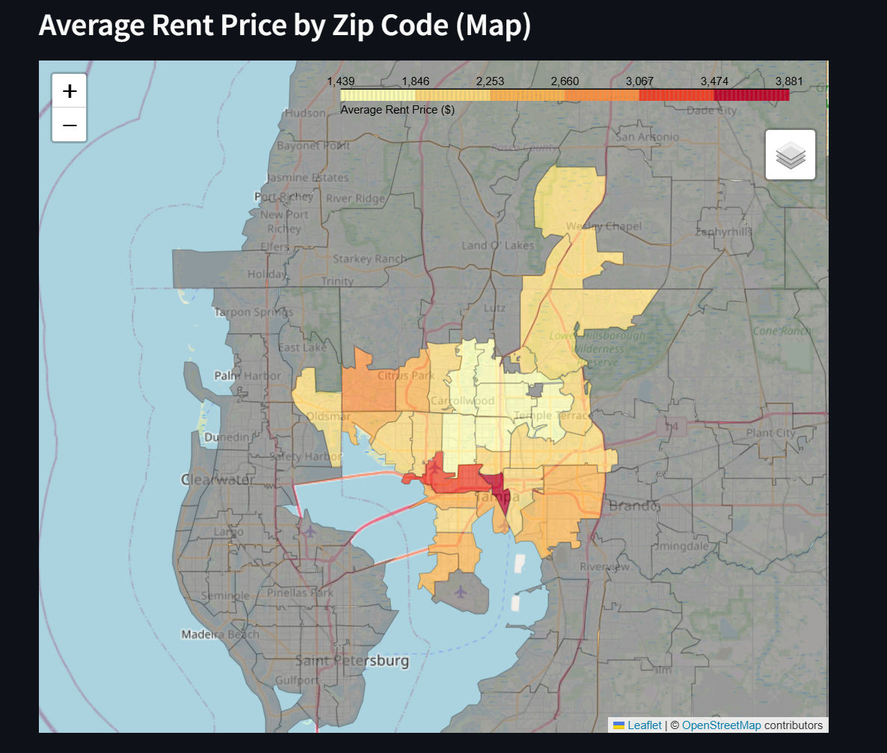
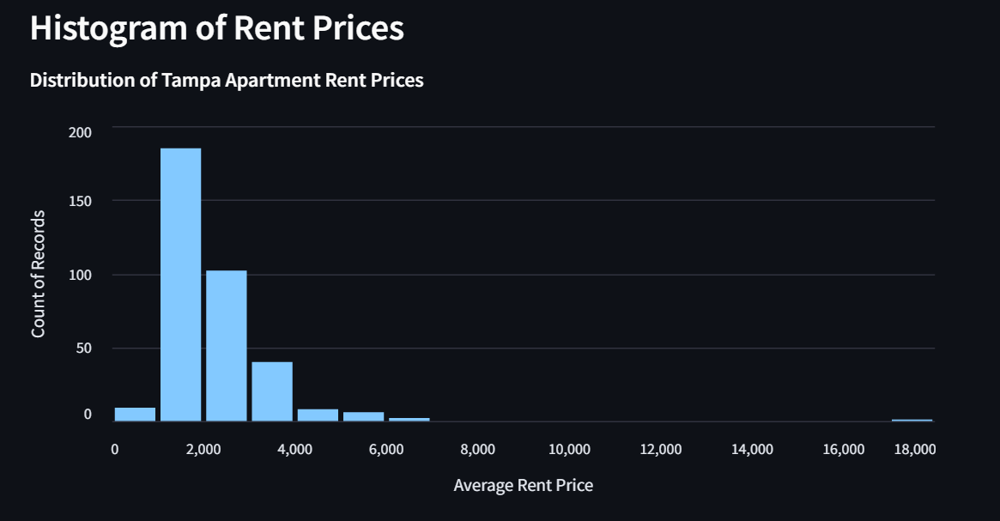
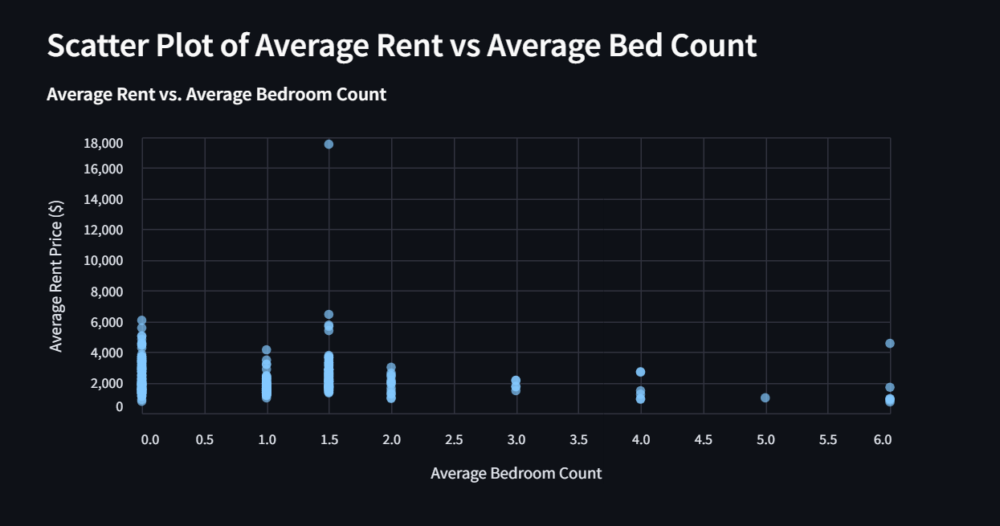
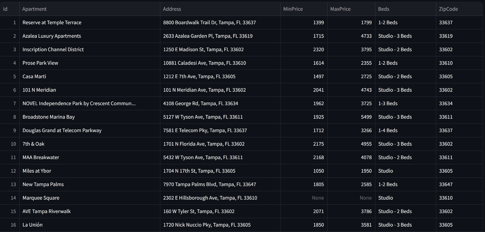
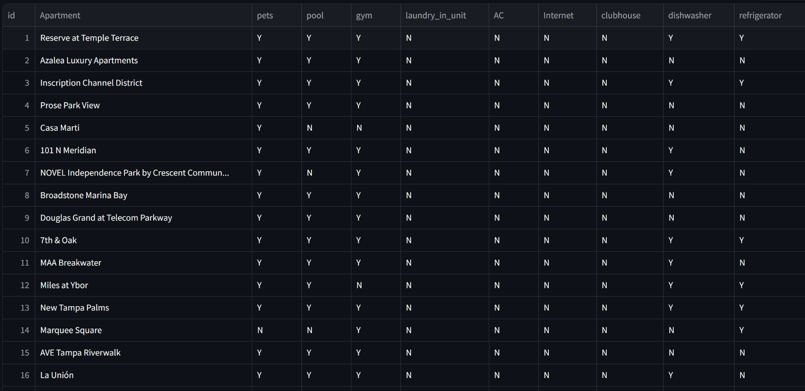

# 🏙️Tampa Apartment Rent Analysis

This is a **data science and visualization project** built to support apartment hunting in **Tampa, Florida**. It uses web scraping, data analysis, and an interactive Streamlit app to explore rental trends and amenities.

🔗 **[Click here to view the live Streamlit app](https://homefinder-tampa.streamlit.app/)**

## Project Purpose

The goal of this project was two-fold:
1. Assist in my personal apartment search.
2. Demonstrate my skills in **Python**, **web scraping**, **data cleaning**, **data visualization**, and **app deployment with Streamlit**.

---

## Features

- **Web Scraping** from [Apartments.com](https://www.apartments.com) using `Selenium` and `pandas`.
- **Relational Data Storage** using **SQLite**, separating apartment data and amenities via a common `id` key.
- **Interactive Streamlit App** that displays:
  - 📍 A **Folium map** showing average rent by zip code.
  - 📊 An **Altair histogram** of rent prices.
  - 🛏️ A **scatter plot** of bed count vs rent.
  - 🧺 A merged table of apartment names and their amenities.

---

## Tech Stack

| Purpose           | Library/Tool       |
|------------------|--------------------|
| Web Scraping      | `Selenium`, `pandas` |
| Data Storage      | `SQLite`, `pandas` |
| Web App UI        | `Streamlit` |
| Maps              | `Folium` |
| Charts/Graphs     | `Altair` |
| HTML Embedding    | `streamlit.components.v1` |

---

## How It Works

1. Apartment data (name, price, bed count, amenities) is scraped from Apartments.com.
2. Two SQLite tables are created:
   - `apartments`: main listing info
   - `amenities`: separated by `id` key
3. Data is displayed through a Streamlit app:
   - A **Folium map** visualizes average rent by zip code.
   - An **Altair histogram** shows rent distribution.
   - A **scatter plot** displays the relationship between average rent and average bed count.
   - An **amenity table** joins both datasets for a clearer view.

---

## 📸 Screenshots

### Average Rent Price by Zip Code (Folium Map)

### Histogram of Rent Prices

### Scatter Plot: Average Rent vs Bed Count

### Apartment Table

### Amenities Table

---

## 📂 File Structure

├── amenity_separator.py                    # Separates amenity data from apartment data   
├── apartment_data.db                       # SQLite database   
├── chromedriver                            # Web Scraping tool for apartments.com   
├── dashboard.py                            # Streamlit app   
├── fl_florida_zip_codes_geo.min.json       # Map of florida used to plot zipcodes   
├── requirements.txt                        # List of dependencies   
├── sql_main.py                             # Creates SQL tables   
├── visualizations.py                       # Functions for folium map and altair charts   
├── zip codes.py                            # Isolate zip codes from scraped data   
├── zip_price_map.html                      # Rendered folium map   
└── README.md                               # Project documentation  

--

**Brandon Latimer**  
_Data Science Enthusiast • Python Developer_

)  

